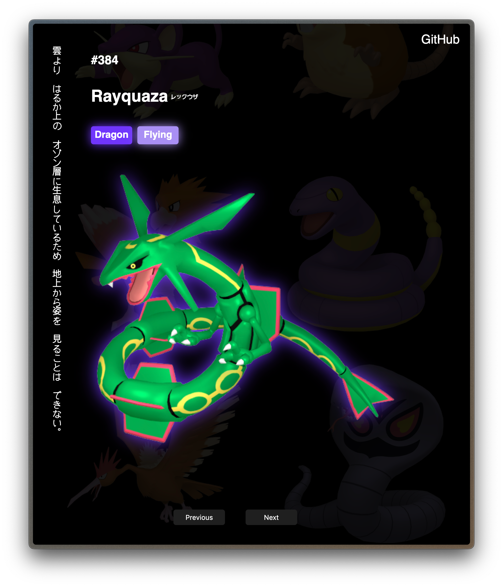

# Pokédex

A web-based Pokédex application that allows users to browse through all 1118 Pokémon with detailed information for each one.

Another beginner coding project, after diving deeper into JS and continuing to learn as much as I can, this project especially is focusing on API implementation and getting myself comfortable with fetching data.


<div align="center">
  
  
</div>

## Features

- Browse through all 1118 Pokémon
- View detailed information including:
  - Pokémon name (English and Japanese)
  - Pokémon number
  - Type(s)
  - High-quality sprites/images
  - Base stats (HP, Attack, Defense, Special Attack, Special Defense, Speed)
  - Abilities
  - Height and weight
  - Pokédex entries (English and Japanese)
- Mobile responsive design
- Complete moveset for each Pokémon
- Type coloring with visual effects

## Technologies Used

- HTML/CSS/JavaScript
- Express.js for the server
- [PokéAPI](https://pokeapi.co/) for Pokémon data

## Getting Started

### Prerequisites

- Node.js and npm installed

### Installation

1. Clone the repository:
   ```
   git clone https://github.com/yourusername/pokedex.git
   cd pokedex
   ```

2. Install dependencies:
   ```
   npm install
   ```

3. Start the development server:
   ```
   npm run dev
   ```

4. Open your browser and navigate to `http://localhost:3000`

## Upcoming Features

- [ ] Search functionality to find specific Pokémon
- [ ] Additional filtering options by type and generation
- [ ] API data caching for improved performance
- [ ] Enhanced background graphics
- [ ] Favorites system to save preferred Pokémon

## API

This application uses the [PokéAPI](https://pokeapi.co/) to retrieve Pokémon data. The API is free to use and provides comprehensive information about Pokémon.

## License

[MIT](LICENSE)

## Acknowledgements

- [PokéAPI](https://pokeapi.co/) for providing the Pokémon data
- Pokémon and all respective names are trademark and © of Nintendo 1996-2023 
